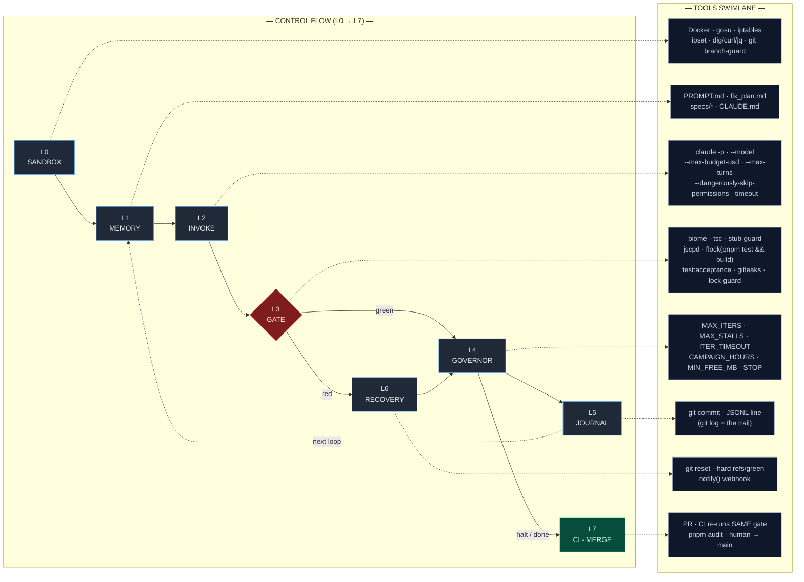

# Backpressure

A **capability pack** for agentic coding CLIs — **Claude Code** and **Codex CLI**.
It is *not* an agent or a runtime: the agent loop, tool execution, and sandboxing
stay with the CLI. Backpressure ships configuration, prompts, and small scripts
that you install *into* an existing CLI to make its autonomous loop converge
instead of drift. (An issue tracker also lives in the tree but is deferred
post-v0 — it isn't installed yet.)

Author each capability **once** and compile it to each CLI's native config
(`backpressure init` does the emitting). See
[`backpressure-architecture.html`](backpressure-architecture.html) for the design
blueprint and rationale.

## Where to go

| You want to… | Read |
|--------------|------|
| Use or extend the toolkit (the `backpressure` CLI, tracker, skills, adapters) | **[`docs/USER_GUIDE.md`](docs/USER_GUIDE.md)** |
| Understand the design (*what* and *why*) | [`backpressure-architecture.html`](backpressure-architecture.html) |
| Work on this codebase (layout, conventions, the one seam) | [`CLAUDE.md`](CLAUDE.md) |
| Learn the Ralph technique this project is named after (beginner guide) | [`docs/RALPH_GUIDE.md`](docs/RALPH_GUIDE.md) |
| See known bugs / trial feedback | [`issues/`](issues/) |

## Quickstart

TypeScript project, Node 20+, pnpm (`corepack enable`).

```bash
pnpm install
pnpm test            # vitest — the acceptance gate
pnpm run check       # biome check . && tsc --noEmit
pnpm run build       # tsup -> dist/ (produces the executable dist/cli.js)

# install the capabilities into the current repo
node dist/cli.js init --target claude --dry-run   # preview the file plan
node dist/cli.js init --target claude             # writes .claude/ + .mcp.json
node dist/cli.js init --target codex              # writes .codex/config.toml
```

Full CLI reference, what `init` installs, and the library API are in the
[User Guide](docs/USER_GUIDE.md).

## Running an autonomous loop

Install the launcher in **one step** — the bundled `backpressure-loop` pack plus a
composite gate **auto-tuned to your stack** (Rust / Node-TS), no network round-trip:

```bash
npx @osxsystem/backpressure@latest init --with-loop
```

Prefer to install the pack explicitly from GitHub (e.g. to pin a specific ref)? That
still works:

```bash
npx @osxsystem/backpressure@latest add osxsystem/backpressure/packs/backpressure-loop
```

Either way you can re-tune the gate after a stack change with `backpressure gate`.

Backpressure isn't a runtime — the loop, context management, and sandboxing stay
with the CLI. What this repo adds is **`/backpressure-loop`**, a launcher command
(`.claude/commands/backpressure-loop.md`) that plans the campaign, wires
Backpressure's composite gate into the CLI's loop, and hands off to a sandboxed
harness (`scripts/ralph-loop.sh`). It runs in **two planes split by the sandbox
boundary**: planning happens live on your host; the loop itself runs *unattended*
inside a container.

```text
  HOST · your live Claude Code session ─ nothing dangerous runs here yet
 ┌──────────────────────────────────────────────────────────────────────────┐
 │  you ▸  /backpressure-loop "add OAuth login with refresh-token rotation"   │
 │                                                                            │
 │  Phase 0 · SAFETY FLOOR                                                     │
 │    on a throwaway worktree?  tree clean?                                    │
 │      └─ no ▸ STOP → git worktree add ../bp-loop -b ralph/auto && cd ../…    │
 │                                                                            │
 │  Phase 1 · PLAN — runs ONCE ────────────────► writes the 4 memory files:   │
 │    specs/*.md   what to build · acceptance criteria · WHY (anti-amnesia)   │
 │    fix_plan.md  ordered  - [ ]  checklist, smallest-shippable first        │
 │    PROMPT.md    standing orders, re-read at the top of every loop          │
 │    CLAUDE.md    how to build / run / test                                  │
 │      └─ git commit  "plan: specs + fix_plan baseline"                       │
 │                                                                            │
 │  Phase 2 · WIRE THE RAILS                                                   │
 │    chmod +x scripts/*          tune backpressure-gate.sh to your stack     │
 │    backpressure init           Stop hook ▸ ./scripts/backpressure-gate.sh  │
 │    add "test:acceptance"       git commit  "rails"                          │
 │                                                                            │
 │  Phase 3 · HAND OFF — PRINTS the launch line, then STOPS.                   │
 │            (the command never runs the loop on your host)                   │
 └───────────────────────────────────┬────────────────────────────────────────┘
                                      │  you run the printed launch line
                                      ▼
 ═══════ SANDBOX BOUNDARY · Docker container + default-deny firewall ══════════
                                      │
 ┌────────────────────────────────────▼───────────────────────────────────────┐
 │  ./scripts/ralph-sandbox-up.sh  →  ralph-loop.sh        ── UNATTENDED ──     │
 │  firewall up → pnpm install → loop while  - [ ]  items remain:               │
 │                                                                             │
 │   ┌──────────────────────────  ONE ITERATION  ───────────────────────────┐  │
 │   │  fresh context, zero memory  ──reads──►  specs/ · fix_plan.md · PROMPT │  │
 │   │                                                                       │  │
 │   │  ① GENERATE    claude -p PROMPT.md   pick the TOP  - [ ] , implement   │  │
 │   │                it + its @acceptance test, one productive commit        │  │
 │   │                              │                                        │  │
 │   │                              ▼                                        │  │
 │   │  ② BACKPRESSURE  backpressure-gate.sh  — one exit code, fail-fast      │  │
 │   │     biome│tsc│stub-guard│dup-guard│build+test│acceptance│secrets│deps  │  │
 │   │              │                              │                         │  │
 │   │         GREEN │                              │ RED                     │  │
 │   │              ▼                              ▼                         │  │
 │   │   git update-ref refs/green HEAD    git reset --hard refs/green        │  │
 │   │   tick the box · keep the commit    (rewind to last-known-good)        │  │
 │   │                                     stalls++                          │  │
 │   └──────────────────────────────┬────────────────────────────────────────┘  │
 │                                  │ loop back                                │
 │   HALT when ▸  no  - [ ]  left = DONE  ·  MAX_STALLS reached  ·  STOP file   │
 │              ·  campaign deadline  ·  low disk     → notify / page a human   │
 │   CAPS (env) ▸  MAX_ITERS · ITER_TIMEOUT · BUDGET_USD · MAX_TURNS · MODEL    │
 └───────────────────────────────────┬─────────────────────────────────────────┘
                                      │  loop exits
                                      ▼
        back on the HOST: you review the branch, then merge to main yourself
        (the loop never pushes, never publishes, never touches main)
```

The point of the boundary: planning is interactive and safe; the loop runs with
permissions bypassed, so it's confined to a Docker container behind a default-deny
firewall. The launcher **refuses to cross that line for you** — Phase 3 only
*prints* the launch line. The **memory files are the contract** between the planes:
each iteration starts amnesiac and rebuilds intent only from `specs/ +
fix_plan.md + PROMPT.md`. **Backpressure is `②`** — the agent generates, the
composite gate pushes back; green advances `refs/green` and ticks a box, red
rewinds to the last green commit so a bad iteration can't accumulate.

`/backpressure-loop` is the supported entry point — it plans the campaign, wires
the gate, and hands off to the sandboxed harness. The tested TypeScript building
blocks (`loop/governor.ts`, `loop/journal.ts`) and the headless-invocation seam
(`seam/run.ts`) are there for assembling your own harness. New to the technique?
See the [Ralph beginner guide](docs/RALPH_GUIDE.md) and the
[User Guide](docs/USER_GUIDE.md#loop-building-blocks).

### Layered controls & the concrete tools at each

The loop is the same box wrapped in seven controls (the L0–L7 injection-point
model from [`docs/RALPH_PRODUCTION_GUIDE.md §2.3`](docs/RALPH_PRODUCTION_GUIDE.md)).
The top lane is the pure control flow (green/red at the **L3 gate**); the bottom
**tools swimlane** runs in parallel — each dotted link maps a stage to the
concrete tools it fires.


